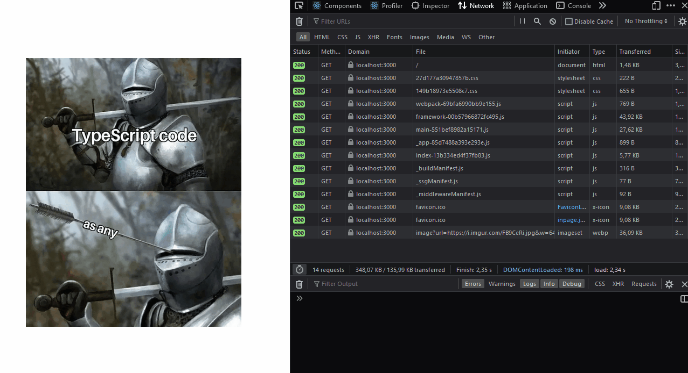

# Next.js image bug

The issue: https://github.com/vercel/next.js/issues/30128

Deployed app: https://nextjs-image-bug.vercel.app/

## Reproduction

1. `npx create-next-app@latest --ts --use-npm .`
2. [Add a remote image](https://github.com/bennettdams/nextjs-image-bug/commit/498908747947dd7652ab8d5d20bc40eed47a4f00)
3. Open the browser and disable cache and throttle the network speed
4. `npm run build && npm run start`
